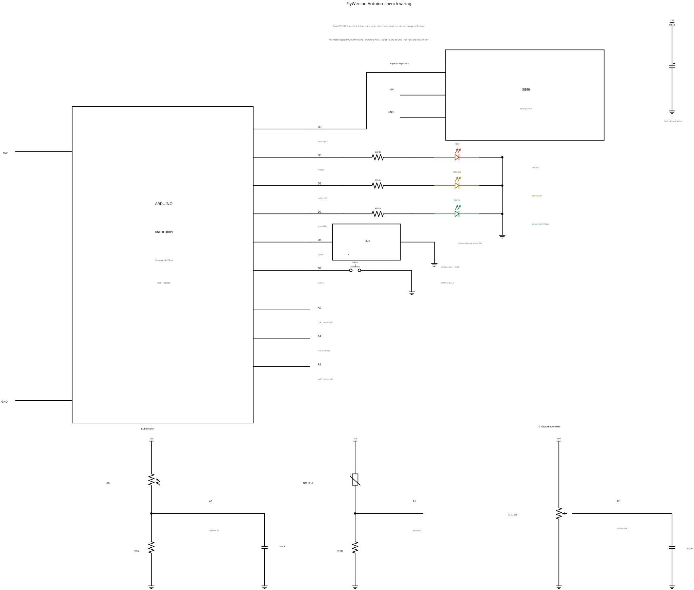

# Hardware

Complete build guide for the **FlyWire on Arduino** bench setup: what is in the
Eletrogate "Kit Start", how to wire it on the 400-point breadboard, and how to
bring it up and diagnose it.

The pin assignment below is the source of truth from
[`board/flywire/flywire.ino`](../board/flywire/flywire.ino). The generated
schematic is [`docs/schematic.svg`](schematic.svg) (PNG: `schematic.png`); it is
produced by `docs/make_schematic.py` (see [Regenerating the schematic](#regenerating-the-schematic)).



---

## 1. Bill of materials (Eletrogate "Kit Start")

The kit ships the parts in the table. "Use" says what this project does with
each item; everything not marked **used** is either **optional** (supporting
role, can be skipped) or a **spare**.

| Qty | Part | Use | Notes |
|---:|------|-----|-------|
| 1 | Arduino UNO R3 (DIP) | **used** | The "body": sensors in, LEDs / servo / buzzer out. USB powered. |
| 1 | USB cable (A–B) | **used** | Power + serial link at 115200 baud. |
| 1 | 400-point breadboard | **used** | All wiring below. |
| ~30 | Jumper wires | **used** | Rails, sensors, LEDs, servo. |
| 1 | Micro servo SG90 | **used** | The "wings": signal D9, 0–180°. |
| 1 | LDR light sensor | **used** | A0 divider — `--sensor ldr`. |
| 1 | 10 kΩ potentiometer | **used** | A2 — `--sensor pot` (default). |
| 1 | NTC 10 kΩ temperature sensor | optional | A1 divider; firmware always reads it, the brain ignores it. |
| 1 | Active 5 V buzzer | optional | D8; beeps on the self-test and on `B <freq>`. |
| 3 | LEDs: 1× red, 1× yellow, 1× green | **used** | D5 sensory, D6 interneuron, D7 motor. |
| 12 | LEDs spare (4× red, 4× yellow, 4× green) | spare | From the 5+5+5 in the kit. |
| 3 | 330 Ω resistor | **used** | One in series with each LED. |
| 12 | 330 Ω resistor | spare | 15 in the kit. |
| 5 | 1 kΩ resistor | spare | Not used. |
| 2 | 10 kΩ resistor | **used** | One in the LDR divider (A0), one in the NTC divider (A1). |
| 3 | 10 kΩ resistor | spare | 5 in the kit. |
| 1 | 10 kΩ potentiometer | **used** | The kit's only pot; wiper to A2. |
| 2 | 100 nF ceramic capacitor | **used** | Decoupling from A0 (and/or A2) to GND. |
| 2 | 100 nF ceramic capacitor | spare | 4 in the kit. |
| 1 | 100 µF electrolytic capacitor | **used** | Bulk cap across 5 V/GND next to the servo. |
| 1 | 100 µF electrolytic capacitor | spare | 2 in the kit. |
| 1 | Tactile push-button | optional | D2 to GND, internal pull-up. |
| 4 | Tactile push-button | spare | 5 in the kit. |
| 1 | 1-digit 7-segment display | spare | Not used in this project. |
| 4 | 1N4007 diode | spare | Not used. |
| 1 | BC548 NPN transistor | spare | Not used. |
| 1 | BC558 PNP transistor | spare | Not used. |
| 4 | 10 nF ceramic capacitor | spare | Not used. |
| 2 | 10 µF electrolytic capacitor | spare | Not used. |

> Minimum required to run `--sensor pot`: UNO + USB + breadboard + jumpers +
> servo + 3 LEDs + 3×330 Ω + the 10 kΩ pot + 1×100 µF. For `--sensor ldr` add
> the LDR + one 10 kΩ. Everything else is optional or spare.

---

## 2. Pinout

All references are to `board/flywire/flywire.ino`. "Dir" is from the Arduino's
point of view.

| Pin | Constant | Dir | Connects to | Firmware action |
|-----|----------|-----|-------------|-----------------|
| D9 | `PIN_SERVO` | out | SG90 signal (orange) | `servo.attach()` / `servo.write()` (0–180°) |
| D5 | `PIN_LED_SENS` | out | Red LED via 330 Ω → GND | `digitalWrite()`; sensory stage (LC4/LPLC2) |
| D6 | `PIN_LED_INTER` | out | Yellow LED via 330 Ω → GND | `digitalWrite()`; interneuron stage |
| D7 | `PIN_LED_MOTOR` | out | Green LED via 330 Ω → GND | `digitalWrite()`; motor / Giant Fiber (DNp01) |
| D8 | `PIN_BUZZER` | out | Active buzzer + → GND | `tone()` / `noTone()` |
| D2 | `PIN_BUTTON` | in | Push-button → GND | `INPUT_PULLUP`; `digitalRead()` (pressed = LOW) |
| A0 | `PIN_LDR` | in | LDR divider midpoint | `analogRead()`; field 1 of the `S` line |
| A1 | `PIN_NTC` | in | NTC divider midpoint | `analogRead()`; field 2 of the `S` line |
| A2 | `PIN_POT` | in | Pot wiper | `analogRead()`; field 3 of the `S` line |
| 5V | — | — | +5V rail | Uno regulator / USB 5 V |
| GND | — | — | GND rail | Common ground |

### Serial protocol (115200 baud)

| Direction | Line | Meaning |
|-----------|------|---------|
| Uno → host, 50 Hz | `S <ldr> <ntc> <pot> <btn>` | Sensor samples 0–1023, button 0/1 |
| host → Uno | `L <sensory> <inter> <motor> <angle>` | LED on/off, servo angle 0–180 |
| host → Uno | `B <freq>` | Buzzer frequency in Hz; `0` off |
| host → Uno | `T` | Run the boot self-test again |

The brain reads field 1 for `--sensor ldr` and field 3 for `--sensor pot`
(`SENSORS` in `brain/run_brain.py`).

---

## 3. Breadboard basics (plain language)

- A 400-point board has **numbered lines** running across it and lettered holes
  **a–j** on each line. There is a central channel (the "dip") between `e` and
  `f`; the Uno's DIP chip or a component can straddle it.
- On each numbered line the holes split into **two isolated 5-hole groups**:
  **a–e** on one side of the channel and **f–j** on the other. All five holes in
  a group are connected; the two groups are **not** connected to each other.
- **A component's two legs must go into different groups.** If both legs land in
  the same 5-hole group they are shorted together and the part does nothing.
  This is the single most common wiring mistake.
- To join two parts, put them in the **same group** of the same numbered line.
  That is a junction (draw a dot for it on paper).
- The **outer rails** (the long rows of holes along the top and bottom edges)
  are the power rails. On most 400-point boards each rail is a single connected
  strip, sometimes split in the middle. Use one rail for **+5V** and one for
  **GND**, and feed them from the Uno's `5V` and `GND` pins.
- The Uno does **not** sit on a 400-point board; keep it beside the board and
  bridge with jumper wires. Power the board from the Uno's headers.

> Rule of thumb: a signal you can see on an LED and a ground rail are never in
> the same 5-hole group unless you intend a short.

---

## 4. Wiring, step by step

Do it in this order. Test after each stage; a fault is much easier to find in
isolation. `D9` = servo signal, and the resistor/LED order is always
**pin → 330 Ω → LED anode (long leg) → LED cathode (short leg) → GND**.

### 4.1 Power rails first

1. Jumper **Uno `5V` → top rail**.
2. Jumper **Uno `GND` → bottom rail**.
3. Optionally bridge the left and right halves of each rail so both ends are live.

### 4.2 Servo SG90

| Servo wire | Colour | Goes to |
|------------|--------|---------|
| Signal | orange (or yellow) | **D9** |
| VCC | red | **+5V rail** |
| GND | brown (or black) | **GND rail** |

Add the **100 µF** electrolytic across the rails right next to the servo:
**long leg (＋) → +5V**, **short leg (−) → GND**. It supplies the current peaks
when the motor moves.

### 4.3 The three LEDs

For each row: **Arduino pin → 330 Ω → LED long leg; LED short leg → GND rail**.

| Pin | Resistor | LED colour | Stage |
|-----|----------|------------|-------|
| D5 | 330 Ω | red | sensory |
| D6 | 330 Ω | yellow | interneuron |
| D7 | 330 Ω | green | motor (Giant Fiber) |

The LED is polarised: the **long leg is the anode** (toward the Arduino), the
**short leg is the cathode** (toward GND). A backwards LED simply stays dark.

### 4.4 Sensor — potentiometer option (`--sensor pot`, default)

The pot has three legs. With the shaft facing you and the pins down, the usual
order is: left, wiper (middle), right.

1. Left leg → **+5V rail**.
2. Right leg → **GND rail**.
3. **Wiper (middle) → A2.**

Add a **100 nF** ceramic capacitor from **A2 to GND** (as close to the analog
pin as possible) to filter servo noise.

### 4.5 Sensor — LDR option (`--sensor ldr`)

The LDR divider is: **5 V → LDR → A0 → 10 kΩ → GND**.

1. LDR leg 1 → **+5V rail**.
2. LDR leg 2 → a free group; also insert **10 kΩ leg 1** into that same group
   (this node is the divider midpoint).
3. 10 kΩ leg 2 → **GND rail**.
4. Jumper the **midpoint → A0**.
5. Add a **100 nF** ceramic from **A0 to GND** (as close to A0 as possible).

Add the NTC divider on A1 the same way if you want it: **5 V → NTC → A1 → 10 kΩ
→ GND**.

### 4.6 Optional parts

- **Buzzer (D8):** `+` → D8, `−` → GND.
- **Button (D2):** one side → D2, other side → GND. No external pull-up is
  needed: the firmware enables the chip's internal pull-up (`INPUT_PULLUP`), so
  the pin reads LOW only while the button is pressed.
- **NTC (A1):** see above.

### 4.7 ASCII breadboard map

The board is flexible, so treat this as a suggested logical layout, not a
to-scale drawing. `+` marks the +5V rail, `−` the GND rail. Each numbered line
is shown as one 10-hole line split into its two groups `a-e | f-j`.

```
        +5V  ●═══════════════════════════════════════════════════════════════════● +5V
                                                                                
   line   a    b    c    d    e    |    f    g    h    i    j         part
   ─────────────────────────────────────────────────────────────────────────────
     1    +5V feed ────●                                               rail feed from Uno 5V
     2    GND feed ────○                                               rail feed from Uno GND
                                                                                
     4    └──── LDR (5V→mid) ────┘    └──── junction ────┘            LDR: leg1 to +5V, leg2 at mid
     5                                 └──── 10 kΩ ────────────┘      mid → 10 kΩ → GND
     6                                 └──── 100 nF ───────────┘      mid (A0) → GND
     8    └── pot: left=+5V, wiper ────┘        right=GND              wiper → A2
    10    └──── NTC (5V→mid) ────┘    └──── junction ────┘            (optional) mid → A1
    11                                 └──── 10 kΩ ────────────┘      (optional) mid → GND
                                                                                
    13    └── 330 Ω ──▷|── red ───────┘                               D5 → LED → GND
    15    └── 330 Ω ──▷|── yellow ────┘                               D6 → LED → GND
    17    └── 330 Ω ──▷|── green ─────┘                               D7 → LED → GND
                                                                                
    19    └─ buzzer + ────────────────┤                               D8 → buzzer → GND
    21    └─ button ──────────────────┤                               D2 → button → GND
    23    └─ servo signal ────────────┤                               D9 → servo signal
                                                                                
        GND  ○═══════════════════════════════════════════════════════════════════○ GND
```

Signal jumpers leave the board to the Uno: `A0`, `A1`, `A2`, `D2`, `D5`, `D6`,
`D7`, `D8`, `D9`, plus the `5V`/`GND` rail feeds.

---

## 5. Power and noise

The SG90 is the noisy part. When it starts or reverses it draws a current spike
that dips the 5 V rail; that dip appears as a glitch on the analog inputs and can
even reset the board.

- **100 µF electrolytic across 5 V and GND, at the servo.** This is the local
  current reservoir for the peaks. Keep the leads short.
- **100 nF ceramic from each analog input (A0 / A2) to GND**, close to the pin.
  This shunts the high-frequency noise the motor brushes inject.
- **Electrolytic polarity matters.** The **long leg is +**, the **short leg is
  −**, and the body has a stripe on the **−** side. + goes to 5 V, − to GND. A
  reversed electrolytic can bulge, leak, or pop. Ceramics and resistors have no
  polarity.
- **A capacitor is an open circuit for DC.** From the supply's point of view a
  cap across 5 V/GND does **not** conduct the DC current; it only helps with
  changes (AC). So if the rail is dead, the cap is not the cause — and it will
  not "short out" the 5 V, even though a multimeter's continuity beep may
  briefly sound while it charges.
- **A reset loop is almost always a brownout or a short.** If the Uno keeps
  rebooting (the boot self-test repeats, the serial link drops), first suspect
  the servo stalling the 5 V rail, then a wiring short. Unplug the servo, retest,
  and add the 100 µF. Check the rails for a dead short with a multimeter.
- The firmware adds a **software** guard too: a median filter, a dead band, and
  a refractory period after each escape break the
  noise → false firing → servo moves → more noise cycle.

---

## 6. Bench bring-up and self-test

### 6.1 Flash the firmware

```bash
arduino-cli compile --fqbn arduino:avr:uno --upload -p /dev/ttyACM0 board/flywire
```

`/dev/ttyACM0` may be `/dev/ttyUSB0` on some boards; check `arduino-cli board
list`. Members of the `dialout` group can open the port without `sudo`.

### 6.2 What the boot self-test does

`setup()` calls `selfTest()` once, on every reset:

1. **Servo sweep** — `0° → 180° → 0°` in 10° steps, then rests at 90°.
2. **LEDs in sequence** — sensory (red, D5) → interneuron (yellow, D6) →
   motor (green, D7), ~150 ms each.
3. **Buzzer** — one 880 Hz beep for ~120 ms (only if a buzzer is fitted).

Then it prints `# flywire ready -- S <ldr> <ntc> <pot> <btn>` and starts sending
`S ...` at 50 Hz. Seeing all three stages means the board, the LEDs and the
servo are alive. Press `T` (or reset) to run the test again.

### 6.3 Check each sensor with the serial console

```bash
.venv/bin/python tools/serial_console.py /dev/ttyACM0
```

It prints the sensor line in a readable form:

```
LDR= 512  NTC= 421  POT= 103  BTN=0
```

- **Pot (A2):** turn the knob end to end; `POT` should sweep roughly 0 → 1023.
- **LDR (A0):** cover it (dark) then shine a lamp on it; `LDR` should change a
  lot — **low** in the dark (near 0, the LDR has high resistance) and **high**
  in bright light (near 1023). The startle demo uses the dark baseline, so the
  flashlight makes it *rise* (see [§8](#8-the-two-startle-inputs)).
- **NTC (A1):** pinch it between your fingers; `NTC` should drift slowly.
- **Button (D2):** `BTN=1` while pressed, `0` otherwise.

To exercise the outputs:

```bash
.venv/bin/python tools/serial_console.py /dev/ttyACM0 --sweep
.venv/bin/python tools/demo_hardware.py /dev/ttyACM0
```

`--sweep` keeps the console open and sweeps the servo / blinks the LEDs.
`demo_hardware.py` walks each LED colour, then sweeps the servo with all three
lights on. Both drain the incoming sensor stream so the link does not stall.

### 6.4 When you do not know which pin a sensor is on

Flash the diagnostic sketch, which streams **all six** analog inputs:

```bash
arduino-cli compile --fqbn arduino:avr:uno --upload -p /dev/ttyACM0 board/flywire_probe
```

It prints `P <a0> <a1> <a2> <a3> <a4> <a5>` at 115200. A **floating** pin reads
noisy and mid-range; a **connected** sensor reads a different, more stable
value. Compare the columns while you turn the knob or shade the LDR.

---

## 7. Diagnostics / troubleshooting

| Symptom | Likely cause | Fix |
|---------|--------------|-----|
| An analog input reads noisy and/or stuck near mid-scale | The pin is **floating** — nothing connected, or a leg in the wrong 5-hole group | Jumper it to the sensor node; confirm the two legs of every part are in different groups. Use `flywire_probe.ino` to compare columns. |
| Pot/LDR reading barely changes | Sensor mis-wired, or the divider resistor is missing / in the wrong group | Re-check **5 V → sensor → A0/A2 → 10 kΩ → GND** and that the midpoint really is the shared group. |
| LDR range collapses / reading saturates in the dark | An LDR needs light to show a range; in the dark its resistance is very high, it sits near 0 and its usable span collapses | Keep some ambient light on the bench, or use the "lit at rest, shadow startles" staging (see [§8](#8-the-two-startle-inputs)). |
| Continuity beep across 5 V and GND with the cap fitted | A capacitor is an **open circuit for DC**; it only passes changing current | Not a short. If the rail is actually dead, look elsewhere (wiring, USB, regulator). |
| Electrolytic cap bulging or hot | Fitted **backwards** (polarity) | Power off, replace it. Long leg / **＋** to 5 V; stripe / short leg to GND. |
| Servo twitches on its own / board resets when it moves | Servo current spikes brown out the 5 V rail | Fit the **100 µF** across 5 V/GND at the servo; consider an external 5 V supply with a common ground. |
| Board reboots every time you open the serial port | Normal: opening the port pulls DTR and **resets the Uno** | Wait ~2.5 s for the boot self-test. `serial_console.py` and the brain already do this. |
| Host `write()` hangs / the board seems frozen | The Uno sends `S ...` at 50 Hz; if the host **does not drain reads**, the TX buffer fills, the loop blocks and the link wedges | Always drain `ser.in_waiting` (as the tools do) and use `write_timeout`. Reset the board if already wedged. |
| Servo only goes 0–180° and then holds | By design: the **SG90 is positional**, not a continuous-rotation motor | Nothing to fix. If you need spin, a different (continuous-rotation) servo is required. |
| LED dark | Backwards LED, wrong pin, or resistor/LED not in series | Long leg (anode) toward the Arduino; pin → 330 Ω → LED → GND. |
| Button reading inverted | Internal pull-up is active | `BTN=1` means pressed (pin pulled to GND). No external resistor is needed. |
| Garbled serial output | Wrong baud or wrong port | Both ends use **115200**; confirm the port with `arduino-cli board list`. |

---

## 8. The two startle inputs

The brain has one control loop; `--sensor` only chooses which column of the `S`
line drives the looming stimulus. Both paths share the same median filter, dead
band, and post-escape refractory period (see `SENSORS` and `LoomingFilter` in
`brain/run_brain.py`).

### 8.1 Potentiometer on A2 — `--sensor pot` (default)

- **Signal:** the pot's absolute position (0–1023) plus the *speed* of its
  change (counts/s).
- **Approach means rising:** a **sharp counter-clockwise turn** (reading going
  up) is the looming. Slow movement is inside the dead band and is ignored.
- **Staging:** start with the knob low and still, then snap it up. The servo
  flaps; after that flight it lands and ignores the pot for the refractory
  period, so a new startle needs a new sharp turn.
- **Run it:**

  ```bash
  cd brain && sg dialout -c '../.venv/bin/python -u run_brain.py --port /dev/ttyACM0 --seconds 0'
  ```

### 8.2 LDR on A0 — `--sensor ldr`

- **Signal:** the *speed* of the light change dominates (the absolute level is
  weighted 0), with a **larger dead band** so dark-room jitter is ignored.
- **Approach means rising:** a **sudden rise in light** is the "predator".
- **Staging (dark → flashlight):** keep the room dark and let the LDR settle
  (a **low**, stable reading, roughly 50), then **arrive with a flashlight**.
  The light is the predator and the fly bolts.
- **Inverted staging (lit → shadow):** keep the room lit and pass a **hand over
  the LDR** to cast a shadow. To make a *fall* mean "approach", flip the LDR
  entry's `direction` to `-1.0` in `SENSORS` (`brain/run_brain.py`).
- **Keep a little ambient light on the LDR when you are not staging the dark
  demo:** in total darkness the divider sits near 0 and its useful range
  collapses.
- **Run it:**

  ```bash
  cd brain && sg dialout -c '../.venv/bin/python -u run_brain.py --port /dev/ttyACM0 --sensor ldr --seconds 0'
  ```

In both modes a stronger startle produces a longer flight, decided at the moment
the Giant Fiber (DNp01) fires.

---

## Regenerating the schematic

The diagram is generated, so it stays in sync with the pinned wiring:

```bash
.venv/bin/pip install schemdraw        # + matplotlib for the PNG
.venv/bin/python docs/make_schematic.py
```

This writes `docs/schematic.svg` (via schemdraw's native SVG backend), the
bonus `docs/schematic.png` (matplotlib backend, when available), verifies that
the SVG parses with `xml.etree.ElementTree`, and prints the file sizes.
`docs/make_schematic.py` is deterministic and uses the pin constants documented
in [`board/flywire/flywire.ino`](../board/flywire/flywire.ino).
